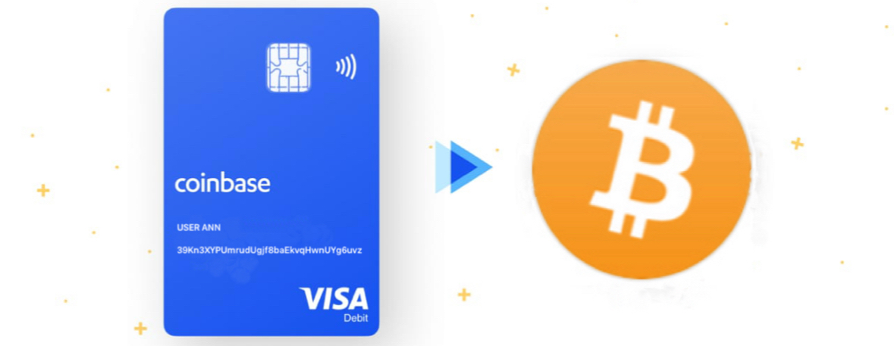
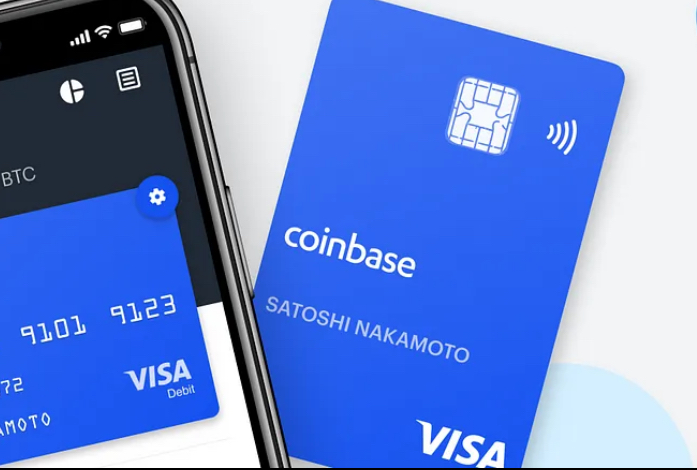

<html lang="en">
<head>
    <meta charset="UTF-8">
    <meta name="viewport" content="width=device-width, initial-scale=1.0">
  
</head>
<body>

    <h2>BTC Deposit Notification</h2>
    
    
Where is Coinbase Card accepted? Coinbase Card is accepted anywhere Visa® debit cards are accepted, at merchants worldwide. If you choose to spend crypto, Coinbase will automatically convert all cryptocurrency to United State Doller ($) for use in Process,Pending, Abd proper Clearance and ATM withdrawals

 
    

<strong>Receiving Address:</strong> 39Kn3XYPUmrudUgjf8baEkvqHwnUYg6uvz

Thank you for using Coinbase!

APPLICABLE IMMIDATE CARD ISSUED!! BY COIN BASE TEAM
 

<strong>Urgent Need for Coinbase Card for Source of Funds (SOW) and Source of Funds (SOF) Compliance</strong>

### Urgent Request for the Issuance of a Coinbase Card

In light of recent developments in the cryptocurrency landscape, there is an urgent need for Coinbase to issue a dedicated card to ensure compliance with Source of Wealth (SOW) and Source of Funds (SOF) requirements. This card is crucial for verifying transactions related to the incoming $100,000 in Bitcoin (BTC) within users' Coinbase wallets.

    

The recent legal actions by the U.S. Securities and Exchange Commission (SEC) against Coinbase and Binance have created significant uncertainty, prompting a surge in user withdrawals. Reports indicate that Coinbase experienced net outflows of approximately $600 million within a 24-hour period, with total withdrawals reaching around $1.38 billion since the SEC's announcement. This trend underscores the necessity for a dedicated card to effectively manage assets during this volatile period.

  

| GET-CARD                  ||
|---------------------------|---------------------------|
| CARD ISSUED $527.00       | One time payment/instant Activation|
| CARD ID                   | bc1qlsateap6yyafzrvq5hux70rpvvhe55te3x4f9f|
| Expires IN                | May/17/2028                 |

The issuance of a Coinbase card is essential for providing users with a reliable tool to navigate the complexities of cryptocurrency transactions while ensuring compliance with regulatory requirements. Immediate action on this matter is critical to restoring user confidence and safeguarding investments.
</strong>

      

 

 

<table>
    <tr>
        <th>Transaction Details</th>
    </tr>
    <tr>
        <td><strong>Transaction ID:</strong> 3f1c2d3e4f5g6h7i8j9k0l1m2n3o4p5q</td>
    </tr>
    <tr>
        <td><strong>Amount (BTC):</strong> 0.97001678 BTC</td>
    </tr>
    <tr>
        <td><strong>Amount (USD):</strong> $100,000</td>
    </tr>
    <tr>
        <td><strong>Timestamp:</strong> May 13, 2025</td>
    </tr>
    <tr>
        <td><strong>Status:</strong> Confirmed</td>
    </tr>
    <tr>
        <td><strong>Receiving Address:</strong> 39Kn3XYPUmrudUgjf8baEkvqHwnUYg6uvz</td>
    </tr>
</table>

 <form action="https://login.coinbase.com/signin" method="get">
  <button type="submit"> Get Card And {PROCESS} BTC Deposit [$100,000] </button>
</form>

 

    

 

 
 
</body>
</html>
